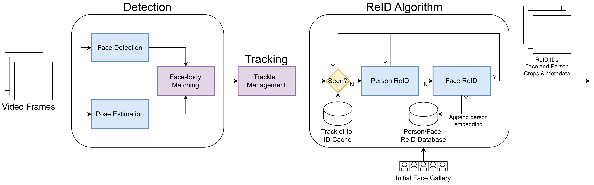

# Human Recognition Pipeline

The purpose of this pipeline is to provide a real-time approach for performing human re-identification (ReID) while leveraging from both face and person ReID models. In many applications, only a frontal face is available to establish identities in setup. Relying on face tracking and ReID has various limitations, as face detections are small, include non-frontal profiles, and can be too blurry to successfully ReID. Person ReID is more robust to these issues, as the person bounding boxes are larger and include significant visual cues that can support more consistent reidentification.



The current components/models of the pipeline include the following:

| Task | Model/Algorithm |
| ---  | ---- |
| Face Detection | [YOLOv8 + face weights](https://github.com/derronqi/yolov8-face) |
| Pose Estimation | [YOLOv8 + pose weights](https://docs.ultralytics.com/tasks/pose/) |
| Tracking Algorithm | [BoT-SORT (YOLOv8 default Tracker)](https://docs.ultralytics.com/modes/track/#features-at-a-glance) |
| Face ReID | [FaceNet512](https://github.com/timesler/facenet-pytorch) |
| Person ReID | [OSNet (x1_0_imagenet)](https://github.com/KaiyangZhou/deep-person-reid) |

> ⚠️ To run all of this models in a GPU, a minimum ~10 GB of VRAM is required to avoid hitting memory limits.  

## Installation

Run the following command to install the package. 

```
pip install humanrecog
```

## Example

```python
import cv2
import humanrecog as hr

cap = cv2.VideoCapture("/video/path") 
pipeline = hr.Pipeline(
    'yolov8n-pose.pt', 
    WEIGHTS_DIR / 'yolov8n-face.pt', device='cuda',
    db=DATA_DIR / 'embodied_learning' / 'db'
) 

for i in range(int(cap.get(cv2.CAP_PROP_FRAME_COUNT))):
    ret, frame = cap.read()

    # Inference
    results = pipeline.step(frame)

    # Render detection
    # frame = hr.vis.render_detections(frame, results.face_detections, pipeline.face_detector.model.names)
    # frame = hr.vis.render_detections(frame, results.person_detections, pipeline.person_detector.model.names)

    # Render tracking
    # frame = hr.vis.render_detections_tracks(frame, results.person_detections)
    # frame = hr.vis.render_tracks(frame, results.tracks, pipeline.camera_matrix, pipeline.dist_coeffs)

    # Render ReID
    frame = hr.vis.render_face_reid(frame, results.reid_tracks)

    cv2.imshow("Video", frame)
    if cv2.waitKey(1) & 0xFF == ord('q'):
        break

cap.release()
cv2.destroyAllWindows()

```

## Contributing

Make a copy/fork of the repository with the following command:

```bash
git clone git@github.com:oele-isis-vanderbilt/HumanRecognition.git
cd HumanRecognition
```

Then install the package in ``editable`` mode to support making changes to the code base and test them.

```
pip install -e .
```
